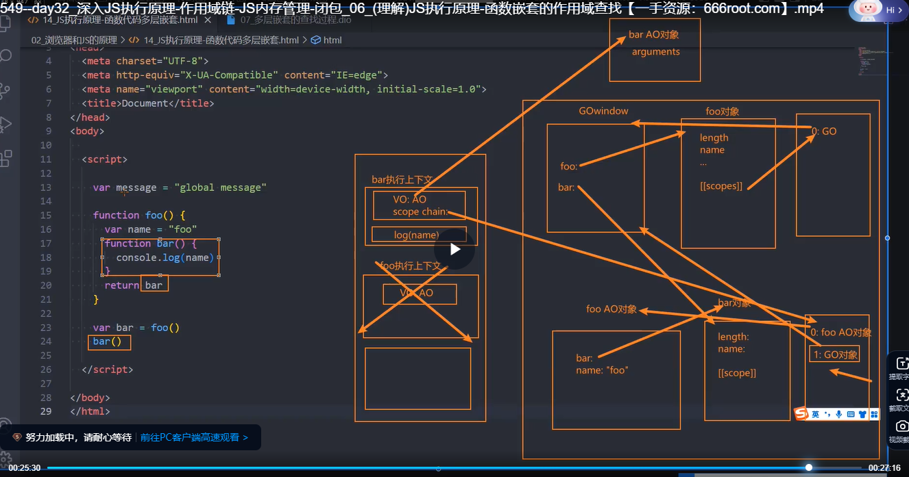
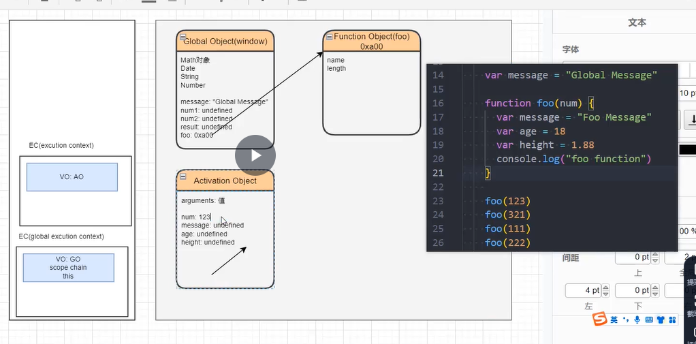
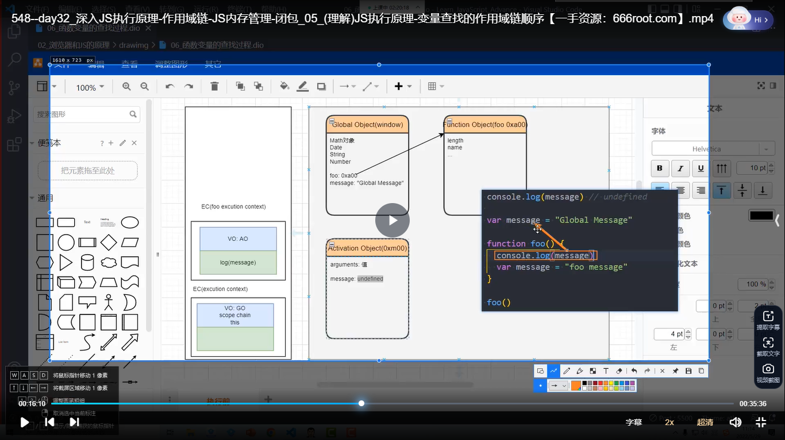
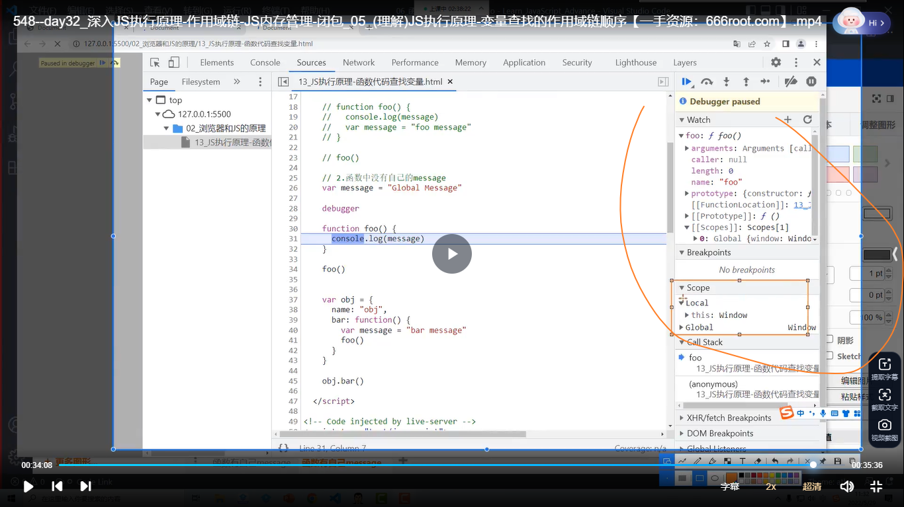

### 一.深入 JS 执行原理




#### 回看没懂的原因： 水没烧开 或 漏条件   --- 检验：看下面的图片那个没懂就立刻看回视频，一下子就明白

1. 注意每一个对象都有3个属性，name，age，length，scope(这个scope记录作用域链，如图中3里面是GO)
2. 第一个VO 等于 GO
3. 执行函数如foo就会在栈中创建个EC
4. var name = ‘foo’ 类似赋值是栈的EC里面执行，只不过堆比如GO保存了“foo”这个值
   - 然后GO或AO里面的name 由undefined 变为了 “foo”
5. 每个EC都有 VO 和 scope
   - scope 
6. 查找过程：比如上面的clg（name），执行是在bar的EC即图中8，就会找name  --- 总结就是会沿着作用域链即EC的scope chain查找
   1. 先在 其EC即图8 的 VO 即 AO 里面找，没有
   2. 回到 EC即图8，通过第二个属性 scope chain（作用域链找）
   3. 通过Oxgoo 找到 图7， 先从0 开始 即找到 foo对应的AO，发现有，就返回把name 赋值
   4. 要是 foo的AO里面没有，就回到图7，进入1的GO，然后在里面找

- 注意 var name = 12 这个赋值的过程是在 栈的EC里面执行，只不过堆比如GO保存了12这个值







- 浏览器控制台看作用域

  - 先debugger再watch里面输入你想查看的一般是函数，里面有scope
  - 然后下面的scope就是具体信息

  


### 1.1. 执行上下文和栈,堆

#### 1.2. 全局对象创建

- 图片里面 VO:GO(gobal object)
- GO 在执行上下文是 GO,其他有叫 window 或 VO


#### 1.3,执行全局代码

- 不是看函数调用位置,而是函数本来位置
  - 因为其决定函数的作用域链的第一个作用域是谁
  
  

#### 1.4. 执行函数代码

    - 每调用一个函数都会在栈(即图片左边)创建一个栈空间
    - 其vo会去找AO(不是GO),AO在堆里面创建,里面属性有argument(参数function(a)的a)


#### 1.5.作用域作用域链

 作用域链是个数组,在堆里面有内存,即图右的最右边的 scope chain


**EC（执行上下文）就像是一个指挥官，它手里拿着两个关键指针：**

1. **VO/AO 指针**：指向堆内存里存变量的那个对象。
2. **Scope Chain 指针**：指向一个数组，数组里按顺序存着所有父级 AO 的引用（用于查找变量）。


### 二.JS 的内存管理

    #### 2.1.GC(garbage collection)实现语法(第一个使用的是list语言)

- 引用计数(如 var a= fn,则 fn 有引用,他在堆内存有个属性叫引用计数,但这个计数为 0,则会销毁)
  - 问题:当两个函数互相引用则有问题
  - 几乎淘汰
- 标记清楚(可达性)
  - 即图片中那个线,看其能不能从 GO 延伸出去,不行则销毁
- v8 本身有的优化
  - 标记整理(即 1,2,3,要是 2 被清除了,其实现 1,3 紧挨着)
  - 分代处理:先划分为新旧区域,一个函数循环了二次则会到旧区域里面,其被检查的次数也会减少(即排查有无可达性优先级会降低)
  - 增量收集:把一次性吃下所有,划分为几块处理,这样就是几个小延迟而不是一个大延迟
  - 闲时收集:即等 cpu 空闲时才处理代码

#### 2.2.闭包概念的理解(即用到作用域链就是)

- 如果一个普通函数可以访问外层变量,则外层变量和这个函数是一个闭包
- 从广义角度,JavaScript 中的函数是闭包
- 狭义说,JavaScript 的函数如果可以访问外层作用域的变量,那么他是个闭包

#### 2.3,闭包的内存流程

即上述图片,用到了 scope chain

#### 2.4. 闭包的内存泄漏

- 即一个可达性的对象(v8 的 GC 清理不了),但你永久都不会用
  - var fn = fuction() {.....} fn(),这里的 fn 要是你以后用不到就是内存泄漏了,其永远占着内存
- 解决:var fn = null(使其不可达)

## 问题与 solve

```
function foo(a) {//这里参数如同let a;只不过为局部变量

       a += 1;
       console.log(a)//11
       return a
    }//局部变量不会影响全局变量,他首先在自己本地找a,找不到才去全局,这里找到a为10,然后执行a+=1,使其变为11


    {
      var a= 10;
      foo(a);
      console.log(a)//10,先本地找到a为10
    }
    console.log(a)//10,去全局
```
