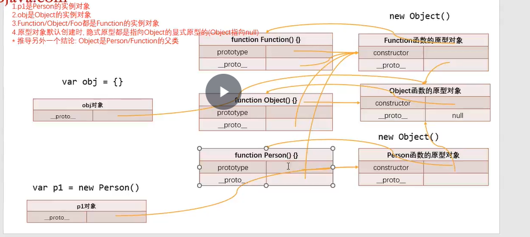

# 一.原型关系图

- 理解这三者关系(注意红字)
  - function Person() {}
  - function Object() {}
  - function Function() {}



# 二. ES6 类的使用

## 2.1 class 定义类

```JavaScript
//ES5中定义类
function Person() {}
//Es6定义类
class Person {}
//另一种定义方式
var Student = class {}
//如同函数var foo = function() {}

//{}的作用
{} -> 对象(没有自己的作用域) {}->代码块 {}->类的结构

//obj的类方法几种定义
var obj = {
    running : function() {},
    eating: () => {},
    swimming() {}//上面的语法糖
}
```

## 2.2 class 类中的内容(属性之间不要逗号)

- constructor 方法

  - 当使用 new 调用类时,默认调用 class 中的 constructor 方法

- 实例方法(即类的原型对象上的方法)

  - ```JavaScript
    class Person {
        constructor(name, age) {
            this.name = name
            this.age = age
        }
        //实例方法
        running() {}
    }
    var p1 = new Person("cao", 18)
    Person.prototype === p1._proto_
    ```

- 访问器方法(方式二后面)

  - 程序员之间的约定:以\_开头的属性和方法,外界不可访问

  - ```JAVAS
    //方式一:对象中的访问器
    const obj = {
    	name : 16,
    }
    Object.defineProperty(obj, 'name', {
    	configurable: true,
    	enumerable: true,
    	set: function() {},
    	get: function() {}
    })

    //方式二: 直接在对象定义访问器
    //监听_name什么时候被访问,设置什么新的值
    const obj = {
    	_name = 'why',
    	//setter方法
    	set name(value) {//必须这样写
    		this._name = value
    	},
    	//getter
    	get name() {
    		return this._name
    	}
    }

    //class类中访问器
    class Person {
    	constructor(naem, age) {
    		this._name = name
    	}
    	set name(value) {
    		this._name = value
    	}
    	get name() {
    		return this._name
    	}
    }
    //应用
    class Rectangle {
    	constructor(x, y, width, height) {
    		this.x = x
    		this.y = y
    		this.w = w
    		this.h = h
    	}
    	get position() {
    		return {x:this.x,y:this.y}
    	}
    }
    //直接调用position即可
    const rect = new Rectangle(10,20,100,200)
    rect.position
    //而不是分别打印rect.width和rect.height
    ```

- 静态方法(static 开头的方法)

  - ```JavaScript
    class Person {
        constructor() {}
        statie running() {}
    }
    ```

## 2.3 class 的 extends

- extends 的关键字(作用:继承,es6 转 es5 讲)

- super 关键字

  - 作用一:继承父类的属性(作用即借用那个方法)

    - ```JavaScript
      constructor(age) {
          super(name)//一定写在this.age前面,同时要在首行
          this,age
      }
      ```

  - 作用二:实例方法 super.method

    - ```JavaScript
      constructor(age) {
          this,age
      }
      //在constructor外面,一般在子类方法中和子类方法合并
      //下面的静态方法一样
      running() {
          super.running()
      }
      ```

    -

  - 作用三:静态方法 super.staticMethod

## 2.4 继承内置类(对内置类进行扩展)

- Array.prototype.xxx

## 2.5 类的混入 Mixin

- JavaScript 的类只能是单继承,即只有一个父类
- 要是想多个父类,则可用混入(mixin)
  - 自己创个方法

# 三.babel: ES6 转 ES5 源码(babel 网站里面)

## 3.1 只写一个 class 类的源码

## 3.2 class 继承 extentds 源码
