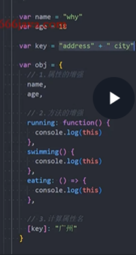
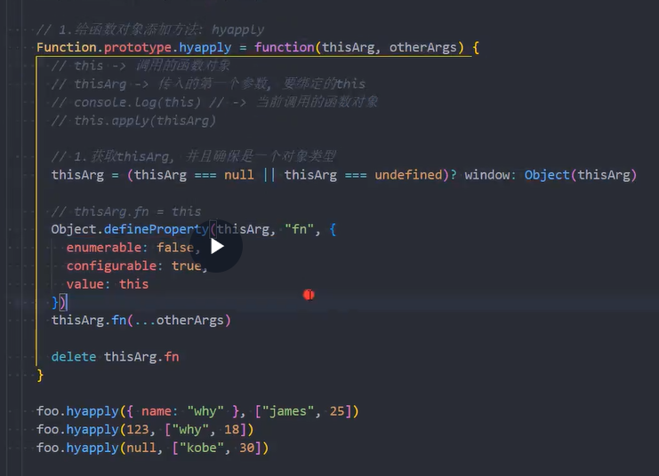
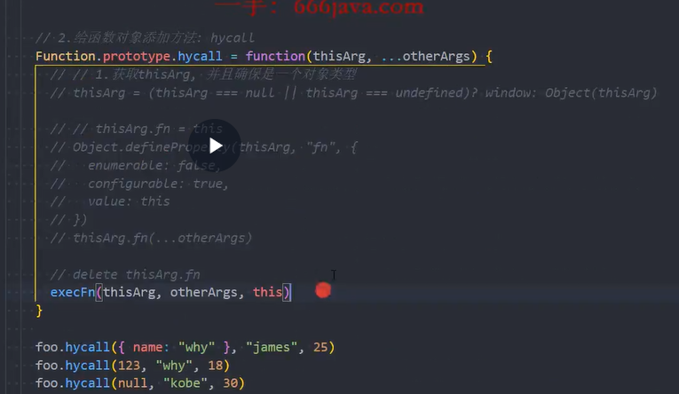
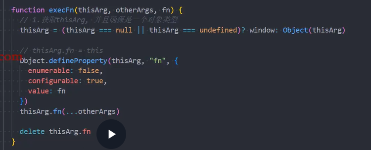
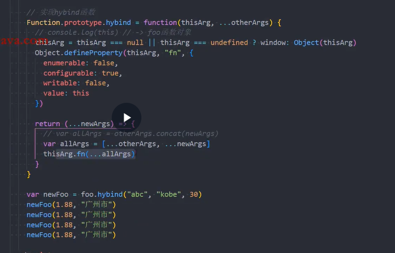
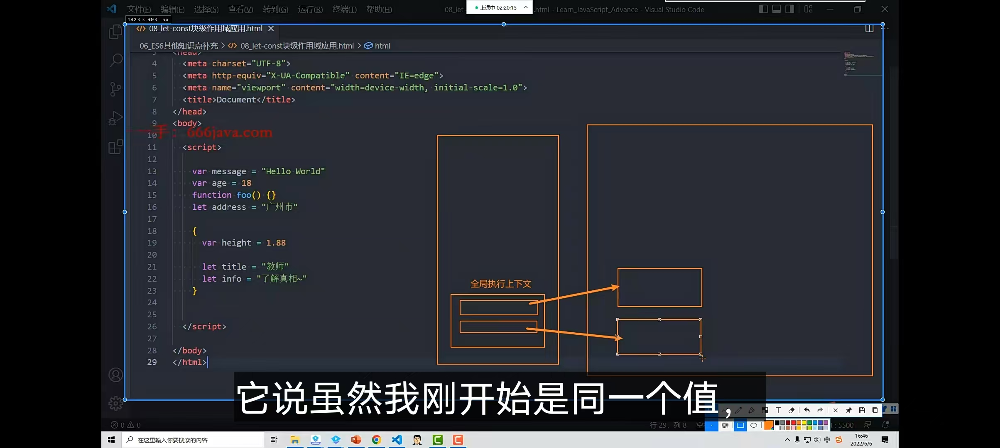
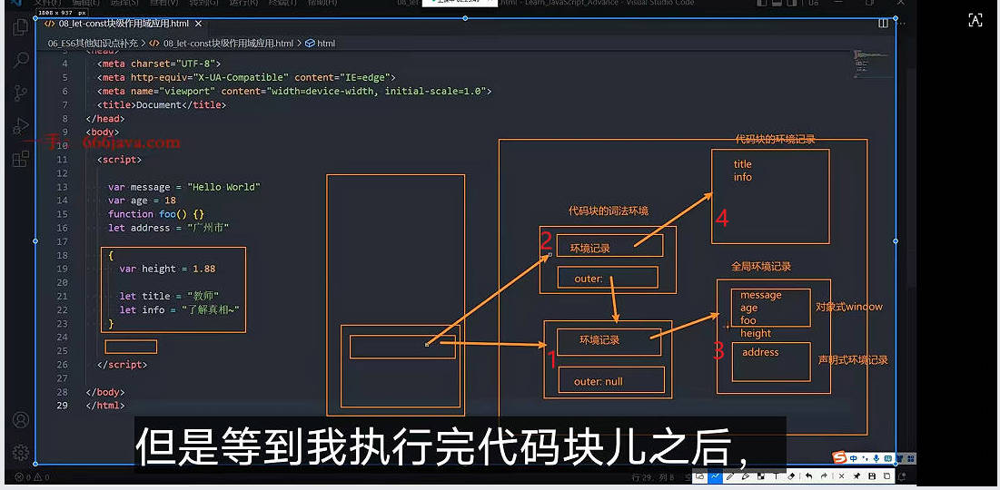
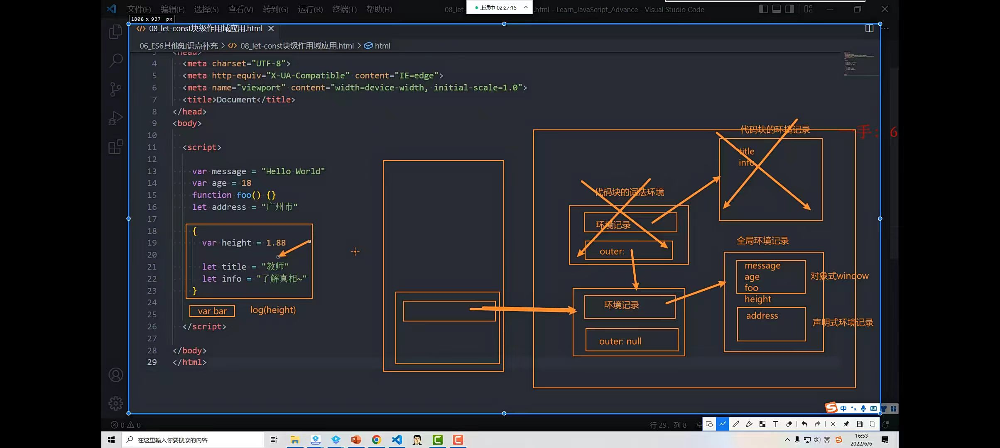
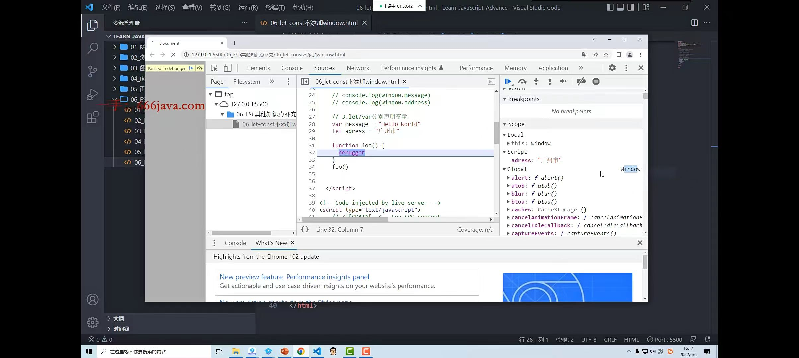
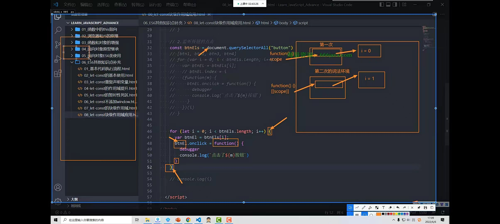

# 一. 面对对象的补充

## 1.1 多态

- 为不同数据类型提供统一接口
- 不同数据进行同一操作,表现不同的行为
- 所以 javascript 到处是多态

## 1.2 对象字面量的增强

- 属性的增强
- 方法的增强
- 计算属性名
- 

## 1.3. 数组和对象的解构

- 数组

  - 基本使用
    - let [a, b] = array1
  - 严格的顺序
    - let [a, ,b]=array1
  - 解构出数组
    - let [a, b, ...c]=array1
  - 解构的默认值
    - let array = [1,2,undefined]
    - let [a,b,c='default']

- 对象

  - ```JavaScript
       //2,对象的解构
        let obj = {name : 'cao', age : 18, height : 1.88}
        //2.1基本使用
        var {name, age} = obj;
    
        //2.2 顺序问题:对象解构没有顺序,根据key解构
        var {age, name} = obj;
        console.log(age, name)
    
        //2.3 对变量进行重命名
        var {name : myName, age} = obj;
        console.log(myName, age)
    
        //2.4 默认值
        let obj2 = {name : undefined, age : undefined, height : 1.88}
        var {
          name : wHeight = 'cao' ,
          age : wAge = 10,
          height : wage
        } = obj2
        console.log(wHeight, wAge, wage)
    
       // 2.5 对象的剩余内容
        var {name, ...rest} = obj;
        console.log(name, rest)//cao {age: 18, height: 1.88}
    
        //应用
        function getPosition({x, y}) {//{x,y}对传入的数据解构了
          console.log(x, y)
        }
        getPosition({x: 10, y: 20})
    ```


# 二,apply/call/bing 实现

#### 在 Function.prototype 中添加的属性和方法,所有函数都可以获取

- ```
  Array.prototype.slice.apply(arguments);
  //等于下面
  [].slice.apply(arguments)
  ```

## 2.1 apply 和 call 的实现

- apply
  - 
- call
  - 

## 2.2. apply 和 call 的封装



## 2.3 bind 函数的实现



# 三. 额外知识补充

## 3.1 新 ECMA 文档术语，原因：在es6前是没有let，const的，所以在es6前所有变量都是放在AO或GO里面，ES6则有声明式环境记录保持

- 词法环境(栈里面)
  - 变量词法环境
  - 全局词法环境
    - 这两个东西当成一个，了解即可



- 词法环境(堆里面)
  - 环境记录，指向全局环境记录 即 3 和 4
    - 全局环境记录中
      - 对象式环境记录 作用和GO相同
      - 声明式环境记录记录 let，const声明的属性 ，作用和 AO 相同
        - 在es6前是没有let，const的，所以在es6前都是放在AO或GO里面，ES6则有声明式环境记录保持
  - 外部环境记录（即outer），指向前一个环境记录
    - 第一个outer是null
  - 
    - 当执行到38行是个代码块即{}，代码块不会创建一个执行上下文（EC），而是创建一个词法环境即上图的2
      - **图中“2”所代表的【代码块的词法环境】里，只有【声明式环境记录】，没有【对象式环境记录】**
      - 图中var声明 height 添加到了对象式 window 里面
      - 
      - 当代码块里面代码执行完成,则由栈里面指出来的箭头没了,则代码块词法环境被销毁

## 3.2 var/let/const 用法

- var 是 JavaScript 的缺陷(不要用)

- 首页 const,当变量要变则改为 let

- ```
   const obj = {
        name: 'John',
      }
      // obj = 3//Uncaught TypeError: Assignment to constant variable.
  
      obj.name = 'John Doe';//可以,因为是obj是赋值引用类型
  ```

## 3.2.1 let/const 有没有作用域提升

- 标识符在词法环境被创建时,会被创建但不能访问
- 作用域提升,在作用域内,可以被提前访问比如 var

## 3.2.2 暂时性死区 TDZ

- 和 let/const ,和 var 无关

- ```
    //1,暂时性死区和位置无关,与执行顺序有关
      function test() {
        console.log(message)
      }
      let message = "hello world"
      test()//hello world
  
      //2,暂时性死区形成之后,这个区域不能访问变量
      let a = 'hello'
      function foo() {
        console.log(a)
        let a = 'world'// Cannot access 'a' before initialization
      }
      foo()
  ```

  

  - 注意 scope 中,let 定义的变量在 script 中,而 var 定义的变量在 global,如下面所说 let/const 的变量不会添加 window


## 3.2.3 let/const 的变量不会添加 window

- Global environment record 构成(上一层是堆里面环境记录如下图)
  - 对象式 window即对象式环境记录
    - 里面包括 var 定义的变量,这个变量不受{}影响,只要是 var 则是全局
    - Function 声明的函数非声明函数比如箭头函数
  - 声明式环境记录对象(let/const 定义的变量在这里面)
- 


## 3.2.5 块级作用域和应用 （懂没懂，看下面案例，没懂则看回视频，一下子就明白了）

- 案例1：

  - ```
      //3
      但foo()在前错
        {
          var cao = 'hello'
          let b = 'hello'
          fuction foo() {
          	clg('foo')
          }
        }
        console.log(cao)//hello
        console.log(b)//b is not defined
        foo()//可以,为了应付社区没人管理的库但又ES5前编译
    ```

    - foo()特殊情况是引擎进行特殊的处理,使其像 var 在外面也可以访问


- 案例2：let 的块级作用域的应用

  

  - 图中btnEls.length个代码块形成的词汇环境不会被销毁，因为匿名function在栈中引用，而这个匿名function又被dom的按钮引用，所以不会销毁
      - 按钮一直在界面上显示，怎么可能被销毁
