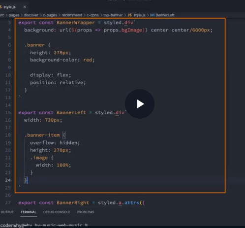

# ES6 中的知识

## 1.1 模板字符串

- 基本使用

  - ${}

- 标签模板字符串

  - ```
       let name = 'cao'

        //标签模版字符串
        function foo(...args) {
          console.log('参数', args)
        }

      	//1,调用方式一
      	foo()
      	//2,调用方式二
        foo`my name is ${name},height is ${1.88}`
        /*
          array[3]
          0 : ['my name is ', ',height is ', '', raw: Array(3)]
          1 :  "cao"
          2 : 1.88
         */
    ```

  - 应用

    - 

## 1.2 函数增强

- 默认参数

  - ```
        function foo(arg1) {
          //1,两种不严谨写法()
          // (1) arg1 = arg1 ? arg1 : '晚上默认值'//下面4种调用值都一样
          // (2) arg1 = arg1 || '晚上默认值'//下面4种调用值都一样

          //严谨写法
          //三元运算符
          // arg = (arg1 === undefined || arg1 === null) ? '晚上默认值' : arg1;//下面值都不是"晚上默认值"

          //ES6写法(上面写法的简化版)
          arg1 = arg1 ?? '晚上默认值';

          console.log(arg1)
        }
        foo(123)
        foo()
        foo(0)
        foo("")
        foo(false)
    ```

    - 默认参数解构

      - ```
        //1,函数的默认值是个对象
            // function foo(obj = {name : 'cao'}) {
            //   console.log(obj.name)
            // }

            //2,函数的默认值是个数组
            // function foo(arr = [1]) {
            //   console.log(arr)
            // }

            //3.解构
            // function foo({name, age} = {name : 'cao', age : 18}) {
            //   console.log(name,age)
            // }

            //3,解构带上默认值
            function foo({name = 'cao', age = 18} = {}) {
              console.log(name,age)
            }
            foo({name : 'zhangsan'})//zhangsan 18
        ```

- 剩余参数

  - 当既有默认参数由于默认值,剩余参数在最后

    - ```
      function foo(age,name='cao', ...args){}
      ```

- 箭头函数的注意事项

  - 没有显示原型 prototype,所以不能作为构造函数使用 new 来创建对象
  - 不绑定 this,arguments,super 参数

## 1.3 展开运算符

```
 //展开运算符是浅拷贝
    function foo(age,name) {
      console.log(age,name)
    }
    const obj = {
      age : 20,
      name : 'john'
    }
    //不可以,展开运算符用于可迭代对象,obj不是一个可迭代对象
    // foo(...obj)

    //展开运算符应用在对象的场景
    let obj3 = {}
    const obj2 = {
      obj3 : obj3,
      ...obj,
    }
    console.log(obj2)
    console.log(obj3 === obj2.obj3)//true
```

## 1.4 引用赋值/浅拷贝/深拷贝

```
  const obj1 = {
      age : 18,
      name : 'codecao',
      obj2 : {
        name : 'codecao2',
      }
    }
    //1,引用赋值
    const info = obj1

    //2,浅拷贝
    const info2 = {...obj1}

    //3,深拷贝:js中没有对应方法
    //方式一:第三方库
    //方法二:自己实现
    //方式三:利用现有的json方法
    const info3 = JSON.parse(JSON.stringify(obj1))
    console.log(info3)
    info3.obj2.name = '没有'
    console.log(obj1)
```

## 1.5 数字的连接符\_

```
   //当数字很大时
   let a = 1000_000_000;
    console.log(a)//1000000000
```

## 1.6 Symbol 符号的使用

- Symbol()都是独一无二的
- Symbol.description
- Symbol.for
- Symbol.keyfor

## 1.7 Set/WeakSet

- new set()

- 是内容不能重复的数组
- WeakSet 和 set 区别
  - 前者只能存放对象
  - 对对象是弱引用
    - 弱引用则这个内存不用则销毁
- 属性

  - set.size

- 方法
  - add
  - delete
  - has
  - clear()
  - forEach
  - 支持 for..of,里面有遍历器
- set 里面的方法和属性 weakset 也有

## 1.8 Map/WeakMap

- 产生原因:对象的 key 不能是复杂类型比如对象,只能是字符串和 Symbol

- new Map()

- key 可以是对象类型
- WeakMap 和 Map 区别
  - WeakMap 的 key 必须是对象
  - 对对象是弱引用
- 方法和属性和 set 一样,且都支持 for..of

## 二,ES7-ES11 的知识点

## 2.1ES7 知识点

- include

  - a.includes(item),a 是数组

- \*\*
  - 平方

## 2.2 ES8 知识点

- Object.keys()

- Object.values()

- Object.enties()

  - ```
     const obj = {
          name : 'John Doe',
          age : 18
        }
        const entries = Object.entries(obj)
        console.log(entries)//[Array(2), Array(2)]
        for (const entry of entries) {
          const {key, value} = entry
          console.log(key, value)//name John Doe age 18
        }
    ```

- String- padStart/padEnd

  - a.padStart(2,'0')//a 是字符串

- traling commas

  - function foo(num1,num2,)
  - foo(10,20,)可以加逗号

## 2.3 ES10 知识点

- flat/flatMap

- Object.fromEntries

  - // entries 将对象转换为键值对数 // fromEntries 将键值对数组转换会为对象
  - 应用: const searchString = '?name=cao&age=18&sex=male'
    - const params = new URLSearchParams(searchString);
    - console.log(params.entries())//返回个迭代器对象，可以使用 for of 遍历

- trimStart/trimEnd

  - ```
    const a = '  hello  '
    a.trim()
    a.trimStart()
    a.trimEnd()
    ```

## 2.4 ES11 知识点

- BigInt -> n

  - 9007199254740991n

- 空值合并运算符??
- 可选择的使用 ?.

  - ```
     //可选择链
        //要判断obj的info对象是否存在，如果不存在则十分危险
        //但用if判断太麻烦
        const obj = {
          name: 'zhangsan',
          age: 18,
          info: {
            sex: '男'
          }
        }
        console.log(obj?.info?.sex)//可选链操作符，如果前面的表达式为null或者undefined则不会报错而是返回undefined
    ```
  -

- for..in 用于遍历对象的 key
