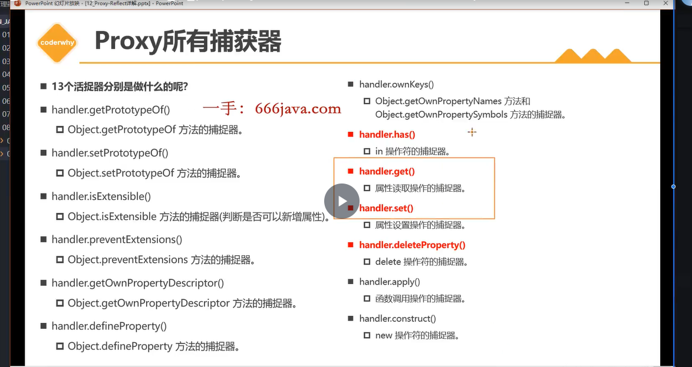

# 一. ESMA 新增知识补充

## 1.1 ES12 知识点

- FinalizationRegistry 对象和 register 对象 : 垃圾回收监听器

- WeakRef

  - ```
        let obj = {
          name : 'codecao',
          age : 18
        }

        // let obj2 = obj
        // let obj3 = obj
        //解决:弱引用
        let obj2 = new WeakRef(obj)

        const finalRegistry = new FinalizationRegistry((value) => {
          console.log('某个对象被回收了', value)
        } )

        finalRegistry.register(obj, 'codecao')

        obj = null
        //问题:这里obj没有被回收,因为obj2和obj3还在引用它
        //但要把obj和obj2都设为null,太麻烦

        //拿到obj2的引用对象,那obj没被回收
        console.log(obj2.deref())//{name: 'codecao', age: 18}
    ```

- 逻辑复制运算符

  - ||=

  - ??=

    - ```
      a = a ?? '我是默认值'
      a ??= '我是默认值'
      ```

  - &&=

    - ```
      obj = obj && obj.name
      obj &&= obj.name
      ```

- replaceAll

  - ```
    const a = 'ni hao ni'
    a.replace('ni', 'buhao')//只能替换一个
    ```

## 1.2 ES13 知识点

- at
  - 字符串和数组的方法
  - a.at()//括号里面输入索引拿到对应的值
- Object.hasOwn(obj,key)//返回布尔类型

  - 和 obj.hasOwnProperty 区别
    - 1,后者是实例方法,可能被读者不小心以同名 hasOwnProperty 方法覆盖掉
    - 2,当 const obj2 = create(null)//创建个新对象,同时这个新对象的隐式原型指向 null
      - 这时用 hasOwnProperty 会报错

- class 成员(fields 字段)

  - ```
       class Person {//不需要加逗号
          constructor(name, age) {
            this.name = name
            this.age = age
          }

          //1,公共实例属性
          height = 180

          //2.公共私有实例属性
          //方法一:程序员之间的约定
          _intro = 'name is cao'

          //方法二:#,程序强行规定
          #_intro = 'name is cao2'

          //3,类属性
          //公共
          static sex = '男'
          //私有
          static #sex = '女'

          //4,block代码:里面的代码当创建新Person对象(new Person())就会被执行:只一次
          static {
            console.log('block代码执行了')
          }
        }
    ```

# 二,Proxy 和 Reflect

## 2.1. Proxy

### 2.1.1.Object.defineProperty

- 基本使用(误区:无限死循环),监听单个/多个属性

  - ```
      // let _name = obj.name
        // //监听一个属性
        // Object.defineProperty(obj, 'name', {
        //   set : function(newValue) {
        //     console.log("监听: 给name属性赋值了", newValue)//codecao2
        //     _name = newValue
        //   },
        //   get : function() {
        //     console.log("监听: 获取了name属性值")

        //     //不能是直接return obj.name, 这样又会触发get方法，造成死循环
        //     return _name
        //   }
        // })

        // console.log(obj.name)//codecao
        // obj.name = 'codecao2'
    ```

  -

- 和 Proxy 区别
  - Object.defineProperty 只用于定义属性,其他用途比如删除修改都是滥用

### 2.2.2.Proxy 基本使用

- new Proxy(target, handler)
- 操作 Proxy 对象

### 2.2.3.Proxy 捕获器(用法上面有)

- set
- get
- has
- deleteProperty
- 

### 2.2.4.apply/construct

## 2.2. Reflect

### 2.2.1. object 方法存在问题

- Object 这个对象中的方法太多

- 而且 object 出现了某种滥用

- Reflect 有返回值,object 没有

  - ```
        const obj = {
          name: 'how',
          age: 20
        }

        Object.defineProperty(obj, 'age', {
          configurable: false,
        })
        // delete obj.age;//报错,在js保持很危险,后面代码都不能执行
        if (Reflect.deleteProperty(obj, 'age')) {
          console.log('删除成功')
        }
        else {
          console.log('删除失败',obj)
        }
    ```

### 2.2.2. 演示 Reflect->返回值(上面)

### 2.2.3. Reflect 和 Proxy 一起使用

- 1,不直接操作原对象
- 2,有返回值
- 3,改变访问器中的 this 指向

  - getter:第三个参数 received

    - 注意:当 getter 方法用到 reciever 参数时,里面值会被调用两次

  - setter 第四个参数 received

### 2.2.4. Reflect 的 construct 用法

- 替换之前的 xx.apply(this,Args)借代方法
- 执行的是 Student.prototype.** proto** === Person.prototype

### 2.2.4. Reflect 里面的方法和 Proxy 一一对应

- 

- 如

  - ```
     const objProxy = new Proxy(obj, {
          set: function (target, key, value, receiver) {
            const isSuccess = Reflect.set(target, key, value, receiver);
            if(!isSuccess) {
              throw new Error(`set ${key} failed`);
            }
          },
    ```

  -

# 三.Promise 使用

- 是一个类

## 3.1.异步代码存在的问题

```
 //问题:1.参数必须看源码,看其怎么设计,比如参数顺序容易错 2.回调嵌套,3.回调地狱
    exeCode(1, (cunter) => {
      console.log("执行成功",value)
    }, (err) => {
      console.log("执行失败",err)
    })
```

## 3.2.使用 Promise 解决

```
     function exeCode(counter) {
      return promise = new Promise((resolve, reject) => {
        setTimeout(() => {
          if (counter > 0) {
            resolve("执行成功");
          } else {
            reject("执行失败");
          }
        }, 1000);
    })
  }

  exeCode(200).then(value => {
      //value是resolve的返回值
      console.log('执行成功', value)
    }).catch(err => {
      console.log('执行失败', err)
    })

```

## 3.3.Promise 三种状态

```
new Promise ((rl, rj) => {
	conslog.log(111)//pending
	resolve()//fulfill
	reject()//reject
}
下面的.then和.catch是为了接受,但reject的错误没有catch等方式接受则会报错
```

- pending(待定状态,翻译为等候)

- fulfill
- reject

### 3.3.2 Executor

- 是创建 Promise 是传入的一个回调函数,这个函数会立刻执行,并传入两个参数

  - ```
    new Promise((rl,rj) => {})
    ```

  - 在 Executor 里确定 Promise 状态,一旦状态确定,则不可更改(即状态是 rosolve,则 reject 不可用)

## 3.4.resolve 不同的值

- 普通值 resolve([{}, {}])
- resolve(promise)
- resolve({then:(resolve)=>{clg}})

## 3.5.then 和 catch 方法补充

```
   //支持链式调用
    promise.then(res => {
      console.log('第一种成功',res)
    }).catch(err => {
      console.log('第一种失败',err)
    }).then(res => {//第个then拿到的是前一个then的返回值,这里没有(实际是resolve(undefined)),所有第二个是执行then而不是err.其参数是undefined
      console.log('第二种成功',res)
    }).catch(err => {
      console.log('第二种失败',err)
    })

    //等同于上面的写法,但是第一种写法更清晰
    // promise.then(res => {
    //   console.log('第一种成功',res)
    // },err => {
    //   console.log('第一种失败',err)
    // }).then(res => {//第个then拿到的是前一个then的返回值,这里没有(实际是resolve(undefined)),所有第二个是执行then而不是err.其参数是undefined
    //   console.log('第二种成功',res)
    // },err => {
    //   console.log('第二种失败',err)
    // })
```

## 3.6.Promise 细节补充

```
promise.then((res) => {
      console.log("第一个Promise的then方法",res); // "Success!"
      //1.普通值
      return "Success!"//相当于return Promise.resolve("Success!")

      //2.Promise对象
      // return new Promise((resolve, reject) => {
      //   setTimeout(() => {
      //   resolve('Success!')
      //   }, 1000)
      // })

      // // 3. thenable值
      // return {
      //   then: function(resolve) {
      //     resolve('thenable!')
      //   }

      // }

    }).then(res => {
      console.log("第二个Promise的then",res); // "Success!"
    })
    //当promise状态是reject时,直接跳到最近的reject,跳过前面的then方法
    .catch(err => {
      console.log('第一个Promise的catch方法',err); // "Error!"

    })
```

### 1.1. then 和 catch 都是实例方法

### 1.1.1 then 方法的返回新 Promise

- then 中的回调来决定

### 1.1.2 catch 方法的返回新 Promise

- catch 执行,由前面某一个 Promise reject 决定
- catch 返回值,catch 传入的回调来决定

### 1.1.3 finally 方法(ES9)

### 1.1.4 中断函数

- 1. return 2. throw new Error() 3. yield

```
promise.then((res) => {
      throw new Error("Error!");//这个then方法后面的代码不会执行,直接跳到catch方法中
      console.log("第一个Promise的then方法",res);
      return "Success!"
    }).then(res => {
      console.log("第二个Promise的then",res);
    })
    .catch(err => {
      console.log('第一个Promise的catch方法',err);
    })//必须要有catch方法捕获错误，否则会抛出异常
```

# 3.7 类方法

### 1 resolve

- 现成的内容了,想把其转为 Promise 来使用

- ```
  Promise.resove('why')
  等价于:new Promise((resolve)=> resolve('why'))
  ```

- 参数:
  1. 普通值('why')
  2. Promise
  3. thenable

### 2. reject

```
  const promise = Promise.reject(123);
    //等价于
    new Promise((_, reject) => {//当前一个参数没用，所以用_代替
      reject(123);
    })
```

### 3 all

```
Promise.all([promise1, promise2,p3,promise]).then(([result1, result2,result3]) => {
      console.log(result1); // 123
      console.log(result2); // 'foo'
      console.log(result3); // 'foo'
    }).catch(error => {
      console.log(error); // 如果有任何一个失败了，就会走到这里
    })
```

- 注意 Promise 是大写

- 等到所以的 Promise 有 resolve 结果,拿到数组
- 如果过程中有个 reject,那么 all Promise 为 reject

### 4 allSettled

- 等到所有的 Promise 都有结果(无论是 resolve 还是 reject,拿到数组:[{status: value/reason}])

- 用 then 方法捕获,而不是 catch

```
  Promise.allSettled([promise1, promise2,p3,promise]).then(results => {
      results.forEach((result) => {
        console.log(result);
      });
    })

```

### 5 rece

- 竞赛: 有一个有结果,不管这个结果是 fulfilled 还是 rejected

### 6 any

- 任意:等到一个 fulfilled,如果都不是 fulfilled 生成一个错误对象

```
Promise.any([promise1, promise2,p3,promise]).then(result => {
      console.log(result); // promise1成功
    }).catch(error => {
      console.log('没有一个成功的');
    })

  Promise.any([promise]).then(result => {
      console.log(result); // 第一个完成的 Promise 的结果
    }).catch(error => {
      console.log('没有一个成功的',error);
   })//没有一个成功的 AggregateError: All promises were rejected
```
