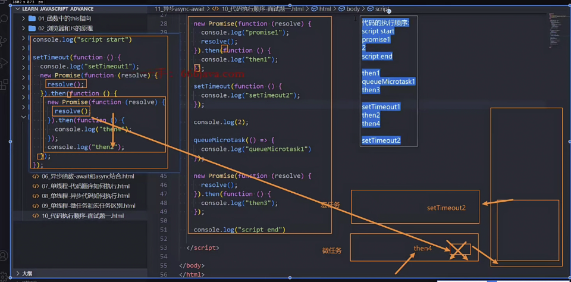
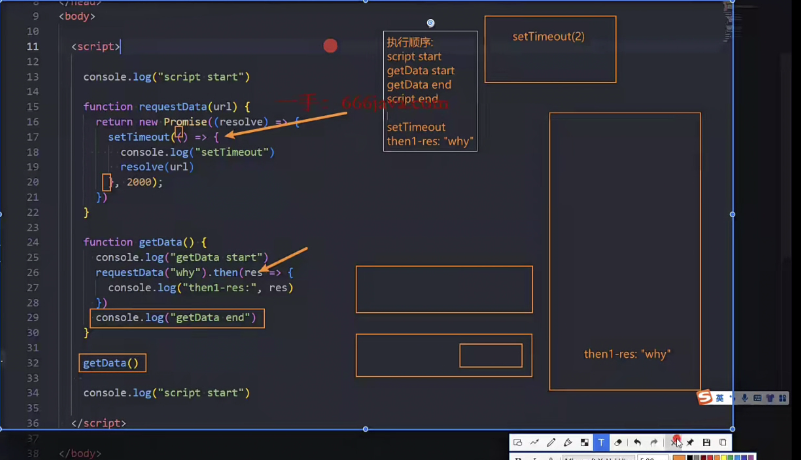
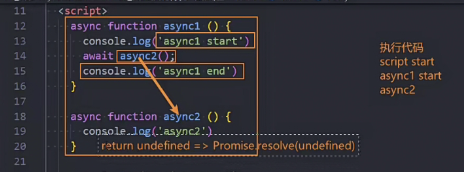
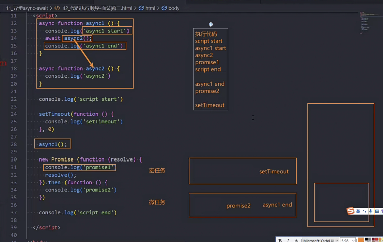
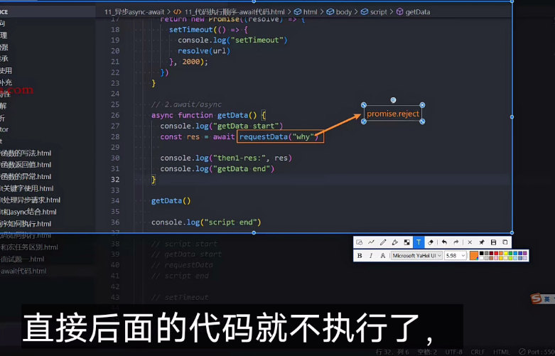
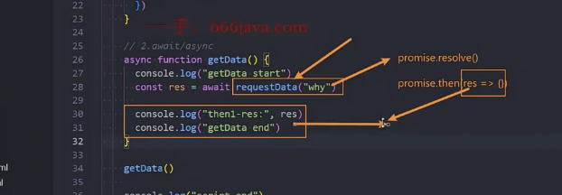

# 一. async/await

## 2.1 异步函数 async

```
普通函数
function foo() {}
匿名函数
(function(){})
箭头函数
() =>{}
异步处理函数
async function foo() {}
//类里面
class Person{
	//异步
	async running(){}

	//生成器函数
	*running(){}
}
```

## 2.2 异步函数返回值

- 普通值:包裹 Promise
- Promise
- thenable

  - ```
    async function foo() {
    	return {
    		then: function(resolve, reject) {
    			resolve('xx')
    		}
    	}
    }
    ```

  - 调用: foo().then(res => {})

## 2.3 异步函数异常处理

- ```
    async function foo() {
        //异步函数出现报错,不会像普通函数一样直接报错,而是会把错误作为Promise.reject()处理,这样外部catch()方法可以捕获错误

        //方式一:不用返回
        /*
          "abc".filter() 直接在 foo() 里抛出了同步错误（TypeError）。
          然后 async function 会自动把抛出的同步错误变成 rejected 的 Promise
        */
        // 'abc'.filter()//捕获的错误 err TypeError: "abc".filter is not a function

        //方式二:自定义条件要是报错
         if (false) {
          throw new Error('反正错了')//err Error: 反正错了
        }

        //方式三:自己返回个新的Promise
        // return new Promise((resolve, reject) => {
        //   reject('反正错了')
        // })

        //方式四
         //return  Promise.reject('反正错了')

        // 方法五:最常用:这一步外部不用再捕获(即外部不需要再.catch),自己可以
        try {
          aa
        } catch (error) {
          console.log('捕获到错误', error)//捕获到错误 ReferenceError: aa is not defined
        }
      }
      //foo().then(res => console.log('res', res))
      //.catch(err => console.log('err', err))

      //方式五
      foo()
  ```

## 2.4 async 中使用 await

- await 表达式 返回 Promise

  - const res = await foo()
  - 和 const res = yield foo()区别
    - 这里还要先拿到 generator 生成器,再 generator.next()依次拿到
    - 而 await 直接拿到,对应的返回值就是 res

- await 后续的代码等到 Promise 有 resolve 结果时(即结果是 fulfill),才继续执行

  - 后面代码不执行

- 应用:多次请求,要求第二次请求要第一次请求的值,且在不同函数里面

  - ```
    function fn1('url') {}
    function fn2('url2') {}
    ..

    function awaitFn('url') {
    	const res1 = await fn1('url')
    	const res2 = await fn2(res1)
    }
    ```

  -

# 二. 事件循环/队列

## 3.1 进程/线程

- 工厂是进程,里面的工人是线程

## 3.2 javascript 是单线程

## 3.3 事件队列/事件循环

## 3.4 宏任务/微任务

- 区分
  - 在执行下一个宏任务之前,会清空微任务队列

-微任务(队列).png>)

## 3.5 面试题: Promise/async/await













# 三.异常处理

- javascript 中出错误是个非常危险的事,后面的代码全都不执行

## 4.1 异常处理场景

- return
  - 缺点:调用者不知道函数内部是什么问题,只知道结果是个 undefined
- throw
  - 让自己知道发生了什么

## 4.2 throw 抛出异常

- number/string/boolean
- 自定义对象
- new Errow()

```
function foo() {
      //1. number/String/boolean
      // throw '是个错误' //Uncaught 是个错误

      //2. 抛出一个自定义对象
      // throw { errMessage: '我是一个错误对象', errCode: 1002 }


      // 3. error类: JavaScript内置的错误类
      // 可以反映错误函数的调用栈以及位置信息

      throw new Error('我是一个错误对象')
      // 结果
      /*
      throw的使用.html:19 Uncaught Error: 我是一个错误对象
      at foo (throw的使用.html:19:13): 抛出错误的位置
      at throw的使用.html:24:5: 调用栈
      */


      //抛出错误后，后面的代码不会执行了
      console.log('foo function end')
    }
```

### 4.3 Error 类的三个属性和一些子类

##### 三个属性

- message

- name

- stack

- ```
    try {
        let arr = new Array(-1);  // 创建数组时指定了非法长度，导致 RangeError
      } catch (e) {
        console.log("message 属性:", e.message);  // 通常为 "Invalid array length"
        console.log("name 属性:", e.name);        // "RangeError"
        console.log("stack 属性:", e.stack);      // 调用堆栈信息

  ```

##### 子类

- typeError

- rangeError

- syntaxError

  - ```
       var a = `var b = 2;console.log(b);`
        eval(a)//2
        try {
          eval("function()");  // 使用 eval() 执行非法代码，导致 SyntaxError
        } catch (e) {
          console.log("message 属性:", e.message);  // "Identifier 'x' has already been declared"
          console.log("name 属性:", e.name);        // "SyntaxError"
          console.log("stack 属性:", e.stack);      // 调用堆栈信息
        }
    ```

## 4.4 捕获异常

- 不捕获异常,当错误通过作用域传到全局则会报错

```
try {

} catch(error) {

} finally {

}
```
