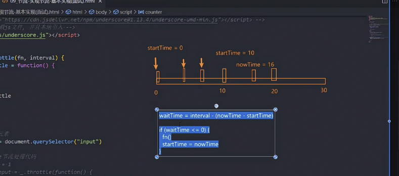
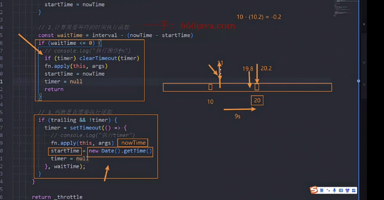
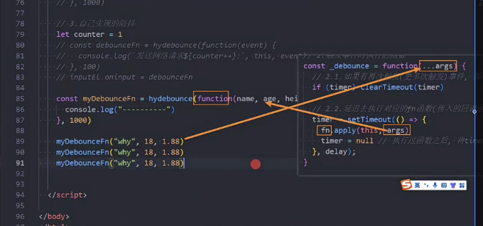

# 一. 防抖和节流(已有相应的库)

## 1.1 防抖实现

#### 概念触发事件才执行响应函数

- 无论触发多少次,只要最后一次和前一次时间不够要求间隔,则不执行
- 达到要求才执行

##### 应用

- 输入框频繁输入
- 点击按钮
- 浏览器滚动事件
- 缩放浏览器的 resize 事件

#### 实现功能

- 基本实现(核心-面试)
- this 和参数的绑定
- 立即执行
- 取消功能
- 返回值

## 1.2 节流实现



#### 概念

无论点击多少次,都是按一定频率执行函数

#### 应用(基本和防抖一样)

- 游戏平 A
- 鼠标移动时间
- 页面滚动

#### 实现

- 基本实现
- this 和参数的绑定
- 立即执行
- 尾部执行

  - 尾部执行核心
  - 

- 取消功能
- 返回值

#### 问题

- 返回值,和函数调用问题
  - 
- 剩余参数和展开(...)

# 二.深拷贝和事件总线

## 暂时性死区(理解)

被 const/let 定义的变量

- 规则:
  - **变量声明后，直到真正执行赋值操作之前，都是不可访问的。**
  - 访问处于 TDZ 的变量会抛出 `ReferenceError` 或 `Cannot access '变量名' before initialization` 错误
- var 定义的变量,声明后立刻被复制了 undefined,所以 JavaScript 允许访问

## 2.1 深拷贝

#### 引用赋值/浅拷贝/深拷贝的区别和关系

- 深拷贝

  - //JSON 规范不允许对象里面有循环引用,否则内部无限递归导致堆栈溢出,所以报错 Uncaught TypeError: Converting circular structure to JSON

    const info4 = JSON.parse(JSON.stringify(info));

#### 手动实现是否为对象功能的函数

- ```
   function isObject(value) {
        const valueType = typeof value;
        //逻辑运算符: &&: 若左侧表达式为true，则返回右侧表达式的值；否则直接返回左侧表达式的值。
        // || : 若左侧表达式为true，则返回左侧表达式的值；否则直接返回右侧表达式的值。
        return (value !== null) && (valueType === 'object' || valueType === 'function');
      }
  ```

#### 实现深拷贝

- 基本实现(递归)

  - ```
     for (const key in originValue) {
        newObj[key] = deepCopy(originValue[key], map);//递归
      }
    ```

- 数组类型

  - ```
      const newObj = Array.isArray(originValue) ? [] : {};
    ```

- 其他类型

  - Set
    - console.log(isObject(new Set([1,2,3])))//true,但 set 的添加方式是 add,不是 newObj[key] = deepCopy(originValue[key]),所以要分类判断,给 set 深拷贝用其他 add 方法
  - 函数
    - 函数不需要深拷贝
      - 函数的作用是执行某个行为，而不是存储信息。
        - 直接拷贝,不会影响其功能
      - 而对象和数组储存数据,数据会变化,而函数这个逻辑一般不会变
      - 同时函数深拷贝,会导致闭包的作用域链丢失,导致里面的变量不可用
        - 函数有作用域,对象数组没有
  - Symbol

    - ```
       console.log(isObject(s1))//fales
          // 但
       console.log(typeof s1)//symbol
      ```

    - Symbol 是 key

    - Symbol 是 value

      - 位置必须在!isObject()之前

- 循环引用

  - ```
      // 5. 解决循环引用的问题
      if (map.get(originValue)) return map.get(originValue)
      map.set(originValue, newObj);//目的是为了上一句
    ```

  - ```
    //方法一:不断创建map,然后还要在map = null去销毁,很麻烦(当然最好用weakmap)

    function deepCopy(originValue, map = new WeakMap()) {//最终优化:方法二

      //优化 在deepCopy中
      let map = new WeakMap();//问题:每次递归都要创建新的map,所以把map放到函数的参数上
      }
    ```

​

## 2.2 事件总线

- class HYEventBus

- 方法

  - on(eventName, eventFn)
  - emit(eventName, ...args)
  - off(eventName, eventFn)

- 问题

  - ```
    // // 这里删除不成功,因为这里的箭头函数和注册的箭头函数不是同一个内存地址,所以无法删除成功
        //   eventBus.off('navclick', (name, age, hight) => {
        //     console.log("第二个navclick", name, age, hight)
        //   })
        //   eventBus.emit('navclick', 'why', 18, 1.83)
        // }
    ```

  - 解决

    - 先知道核心问题是什么

    - (name, age, hight) => {
      // console.log("第二个 navclick", name, age, hight)
      // }) 不是注册那个

    - 解决

    - ```
        let click  = (name, age ,height) => {
            console.log("click", name, age, height)
          }
          eventBus.on('click', click)
          btn.onclick = () => {
            // debugger 调试方法
            eventBus.emit('click', 'why', 18, 1.83)
          }

          setTimeout(() => {
            eventBus.off('click', click)
          }, 5000);
      ```
