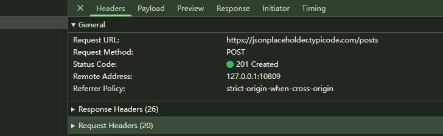
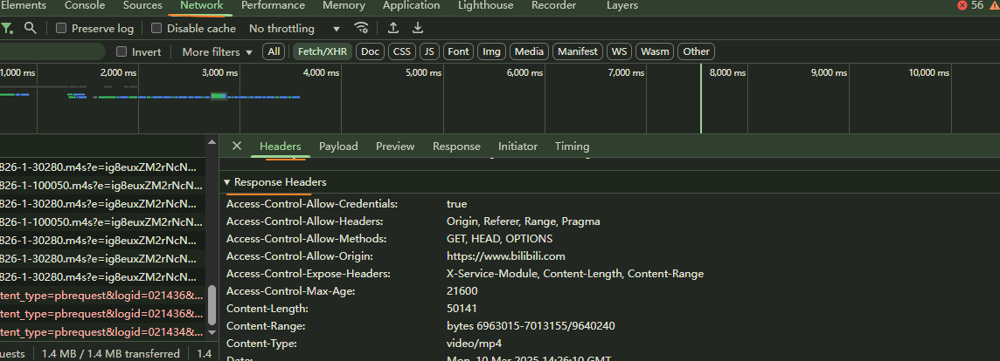

# 一服务端渲染和前后端分离

## 1.1 服务器端渲染

- 即通过 Php/asp/jsp 在服务器就把网站渲染好,在返回给客户端(前端)

- 缺点:
  - 如在一个页面只更新一部分,而非刷新整个页面,这只能前端的如 AJAX 可以做到
  - 同时这里刷新整个页面违背了 DRY(Dont's repeat yourself),类似代码复用
  - 同时上面的情况影响性能

## 1.2 前后端分离

- 后端只需要处理好数据
- 前端在 js 文件中请求数据,然后 Api 服务器在数据库里面以[{},{}]返回数据

# 二,HTTP 协议

## 2.1 HTTP 介绍

- 是客户端(用户)和服务端之间请求和响应的标准
- HyperText Transfer Rrotocol
- 网络传输属于应用层

## 2.2. HTTP 组成

- 请求 request
  - 请求行
    - POST 方法
    - URL(/form/entry)
    - 协议版本(HTTP/1.1)
  - 请求头
    - 
    - 如 content-Type(决定服务器以什么方法出来给服务器的数据)
    - connection
  - 请求体
    - name=codecao&age=38
- 响应 response

  - 响应行

    - 协议版本
    - 状态码
    - ok(状态码的原因短语)

  - 相应头

    - Date
    - Content-Type

  - 响应体

    - 数据(基本是 json)

    - 少数是 xml

      - ```
        <Xml>
        ....
        </Xml>
        ```

## 2.3. 协议版本

- 目前流行的是 1997 年发布的 HTTP/1.1
- 之后如 2018 年的 HTTP/3.0(没人用)

## 2.4. HTTP 请求方式(一般只用前两种)

- GET
- POST(提交数据给服务器)
- 以下是对 POST 的补充
  - PUT:将提交的文件替换服务器目标资源的全部
  - DELETE:删除服务器指点资源
  - PATCH:对某些资源修改
- CONNECT:通过代理和目的服务区建立隧道(少用)
- TRACE:测试和目标资源的路径执行一个消息环回测试(测速)

## 2.5. http request header(请求头内容)



- Content-Type(具体那种类型,看编译服务器解析那个)

  - application/x-www-form-urlencoded

    - 表示数据被编译成以'&'分隔的键值对,同时以'='分隔键和值

  - application/json(json 类型)
  - text/plain(表示文本类型)
  - application/xml(xml 类型)
  - multipart/form-data(表示上传文件)

- connection:

  - keep-alive
    - 即客户端和服务器会有个通道(tcp 协议),不开启则每次请求都要重新捂手建立通道,开启这个通道会延迟端口,时间有服务器决定

- content-length:文件的大小长度
- Accept-Encoding

  - 告诉服务器客户端支持的文件压缩格式,拿到的压缩包浏览器自动帮你解压

- Accept:告知服务器,客户端可以接受的格式类型

## 2.6. response status code

- HTTP Response status Code(报错提醒:方式一)

  - 200(表示请求成功)
  - 201(Post 请求,创建新的资源)
  - 400 以上都是报错
    - 400:客户端出现问题,服务器无法处理
    - 401:没携带身份
    - 403,客户端没权限
    - 404,找不到请求的资源
    - 500 以上都是服务器本身有问题
      - 503,服务器修复中,等下就可以用

- 方式二
  - http status code 是 200,但返回的响应体里面携带了报错原因如{message:'没登录',code:-1004}

# 三. Chrome 插件安装

#### FeHelper

# 四. XMLHttpRequest

## 4.1. 基本使用过程

1. 创建 XML 对象
2. 监听状态的改变(在此处拿到返回的数据)
3. 配置请求 open 如 url
4. 发送 send 网络请求

## 4.2. 监听 onreadystatechange 以及其他监听方法

- 不同状态(这是 XMLHttpRequest 的 state 不是 http)

  - 有 0-4 个状态(XMLHttpRequest.DONE = 4)

    - 只了解 xhr.readyState === XMLHttpRequest.DONE 即可

  - 编写习惯
    - 不要记数字,而是设个常量让其等于 4,这个常量是其作用
    - 这里不用,因为 XMLHttpRequest.DONE 就是常量且等于 4

- 发送同步请求

  - 默认是异步

  - 设为同步方法

    - ```
         const xhr = new XMLHttpRequest();
          xhr.onreadystatechange = function () {
            // console.log(xhr.readyState, xhr.status)
            console.log(xhr.responseText)
          }
          //发送同步请求(后面设为false),必须在send前面
          xhr.open('GET', 'https://jsonplaceholder.typicode.com/posts/1', false);

          // 不能用setTimeout,因为setTimeout是异步
            xhr.send();
            //等到请求完成之后再执行后面的代码
          document.write("<h1>你好</h1>");

      ```

- 除 onreadystatechange 外其他监听方法

  - load(请求成功完成后的回调,和 onreadstatechange 差不多一样)

    - xhr.onload = function() {}

  - ```
        // 过期请求
        const xhr = new XMLHttpRequest();
        xhr.onload = function() {
          console.log(xhr.response)
        }
        //超时会回调ontimeout,且不会触发onload事件
        xhr.ontimeout = function() {
          console.log("请求过期:timeout")
        }

        // 取消后回调的函数
        xhr.onabort = function() {
          console.log("请求取消:abort")
        }

        xhr.responseType = "json";
        xhr.timeout = 10000;
        xhr.open("GET", "https://jsonplaceholder.typicode.com/posts");
        xhr.send();

        // 取消请求
        const  cancelBtn =  document.querySelector("button");
        cancelBtn.addEventListener("click", function() {
          xhr.abort();
        })

    ```

  -

## 4.3 响应的类型和数据(看服务器可以解析那种,不是前端自己决定)

- json 类型接口(一般都是 json 接口,但默认是文本类型)

  - 当 xhr.open('get',"xxx//xxx.xxx.xxx/xx/xx_json")
  - 说明是 json 类型的接口,
  - 要配合 xhr.responseType ="json"

- 当时/xx_text

  - 普通文本,不用配置,默认 content-type:text/plain.....

- 当/xx_xml
  - xhr.responseType = "xml"

## 4.4. 获取相应码

- response.status
- response.statusText:本质和上面一样(看服务器有没有配置)
  - **返回值：** 一个 **描述状态码的文本（字符串）**，例如：
    - `"OK"`（对应 `200`）
    - `"Not Found"`（对应 `404`）
    - `"Internal Server Error"`（对应 `500`）

## 4.5 服务器传递参数(那种方法服务器说的算)


- ```
      //3,设置类型
      // 这里是响应后端返回的数据类型，这里用的是json格式(只看)
      xhr.responseType = "json";
      xhr.timeout = timeout;

      //4,open方法
      if( method.toLowerCase() === "get"){
        const params = []
        for (const key in data) {
          params.push(`${key}=${data[key]}`)
        }
        url = url + "?" + params.join("&")
        xhr.open(method, url);
        xhr.send();
      } else {
        xhr.open(method, url)
        // 设置请求头，告诉后端我们发送的是json格式的数据(只看)
        xhr.setRequestHeader("Content-type", "application/json");

        xhr.send(JSON.stringify(data));
      }
  ```

-

- 方式一: get query

  - xhr.open('GET', 'https://jsonplaceholder.typicode.com/posts?name=why&age=18');

- 方式二: post urlencoded

  - ```
    xhr.open('POST', 'https://jsonplaceholder.typicode.com/posts');
        //设置请求头
    xhr.setRequestHeader('Content-Type', 'application/x-www-form-urlencoded')
        //设置请求体
    xhr.send('name=why&age=18')//不用有分隔符;

    ```

- 方式三:formdata

  - ```
    // xhr.open("post", "https://jsonplaceholder.typicode.com/posts");
          // //fomrElement对象转换成formData对象
          // const formData = new FormData(form)
          // xhr.send(formData)
    ```

- 方式四:json

  - ```
       xhr.open("post", "https://jsonplaceholder.typicode.com/posts");
          //设置请求头
          xhr.setRequestHeader('Content-Type', 'application/json')
          //设置请求体
          const data = {name: form.name.value, age: form.age.value}
          xhr.send(JSON.stringify(data))//必须要json字符串格式;因为上传对象服务器解析不了;
    ```

## 4.6. ajax 的封装(其本质是 XML 对象)

**XHR（XMLHttpRequest）** 是一种 **API（接口）**，用于在浏览器与服务器之间进行 HTTP 请求和响应处理。

**Ajax（异步 JavaScript 和 XML）** 是一种 **技术集合**，它利用 XHR 实现 **异步数据通信**，从而在不刷新整个页面的情况下更新页面内容。

- 基本封装
- 各个参数
- 返回 Promise 回调(解决地狱回调问题)

## 4.7. timeout 和 abort

- 上面

# 五.Fetch

## 5.1. Fetch 的基本使用

## 5.2. Fetch 的代码优化 5.1 的基本使用

- Promise 的 then 中 return

- await/async 的写法

  - ```
     最终优化,上面代码还可以继续优化,使用async await
        async function getData() {
          const res = await fetch('https://jsonplaceholder.typicode.com/posts')
          const response = await res.json()
          console.log("res", response)
        }
        getData()
    ```

## 5.3. Fetch 的请求且携带参数

- json 格式参数

- formdata 格式

- //用 fetch 可以看到 HTTP 状态(不是 XHR 的状态)

  //response.ok,如果是 200-299 之间,则为 true

  console.log(response.ok, response.status, response.statusText, response.type)//true 201 '' 'cors'

# 六.文件上传(之后讲 node 会细讲)

## 6.1.XMLHttpReque 的文件上传

## 6.2. Fetch 的文件上传

```
  <input type="file" class="file">
  <button>上传照片</button>
  <script>
    const uploadBtn = document.querySelector('button');
    uploadBtn.onclick = async function () {
      //表单
      const fileEl = document.querySelector('.file')
      const file = fileEl.files[0]
      console.log("fileEl", fileEl)
      const formData = new FormData()
      formData.append('file', file)

      // 发送fetch请求
      const response = await fetch("xxx", {
        method : 'POST',
        body: formData
      })
      const res = await response.json()
      console.log("res", res)

    }
```
