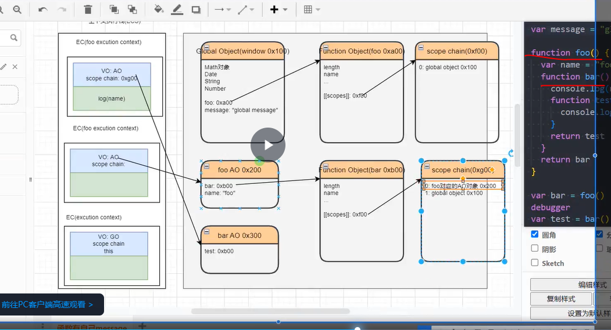
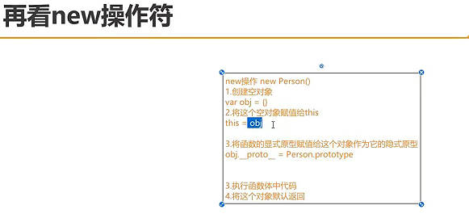

# 先看完原型md，作用域md，letTDZ的md 在看这个文档

### 一。原型链和作用域链综合理解




#### JS 内存管理的核心逻辑就三步：

1.  **代码跑起来**：进栈（左边的框）。 var messag = 1（赋值这个过程）
2.  **数据往哪放**：message = 1 （存值）
    *   基本数据类型（数字、布尔）往往 AO 的属性值里）。
    *   **引用类型（对象、函数）**在 **堆（中间的大框）** 里生成个新框。
        *   因为是对象，故都有name，length，scope指向 scope chain这个对象
3.  **怎么找变量**：
    *   先看自己的vo有吗
    *   栈里的 EC 手里拿着一张地图（Scope Chain，右边的框）。
    *   地图指向了堆里的 AO/GO。
    *   代码里写 `console.log(name)`，引擎就顺着地图（Scope Chain）去堆里的 AO 一个个找，先找 `bar AO`，没有就找 `foo AO`，再没有就找 `GO`。

#### 对你笔记的补充（看完图后的升华）

如果你要完善笔记，可以加上这一句最关键的话：

> **EC（执行上下文）就像是一个指挥官，它手里拿着两个关键指针：**
>
> 1.  **VO/AO 指针**：指向堆内存里存变量的那个对象。
> 2.  **Scope Chain 指针**：指向一个数组，数组里按顺序存着所有父级 AO 的引用（用于查找变量）。


####  闭包的内存泄漏

- **定义**：因为闭包的存在，导致本该销毁的**上层作用域的 AO（活动对象）** 无法被释放，常驻内存。
- **典型场景**：函数返回了一个内部函数，且被外部变量接收。
  
  ```javascript
  function foo() {
      var heavyData = "...";
      return function bar() { console.log(heavyData) }
  }
  var fn = foo(); // fn 拿着 bar，bar 拿着 fooAO(含heavyData)
  ```
- **解决**：`fn = null`。
  
  - **原理**：切断了从根节点（Root/GO）到内部函数的引用，导致内部函数和它引用的 AO 都变成“不可达”，从而触发 GC 回收。

3. **重点解析 `person1.foo2`**（箭头函数的特殊性）。

### 

---


###  二。`bind` 有多强？它和 `apply` 的区别？

你问：*“`bind` 怎么强吗？它和 `apply` 区别？”*

#### 1. `bind` vs `apply/call` （区别）

| 特性         | `call` / `apply`               | `bind`                                         |
| :----------- | :----------------------------- | :--------------------------------------------- |
| **执行时机** | **立即执行** 函数。            | **不执行**，返回一个新的函数（等待未来执行）。 |
| **返回值**   | 函数执行的结果。               | 一个绑定了 `this` 的**新函数**。               |
| **持久性**   | 一次性的。下次调用还得再指定。 | **永久的**。这个新函数的 `this` 被锁死了。     |

#### 2. `bind` 有多强？（硬绑定）

`bind` 返回的函数，其内部的 `this` 是**无法被 `call` 或 `apply` 再次修改的**。这就是所谓的 **“硬绑定 (Hard Binding)”**。

**结论：** `bind` 就像强力胶水，一旦粘上，普通方法（call/apply）撕不下来。

---

### 三。`new Person('person1')` 的过程：



- 图片解释
  - 3.执行函数体中的代码，即执行Person这个函数中的this.name = Person1
  - 4.将这个对象默认返回
    - 意思是 const person1 = new xx 被 person1给保存

#### 先看图片，在看下面

**JS 引擎开始执行 `new Person`**
JS 引擎在栈中创建了一个 `Person` 的执行上下文。
因为是 `new` 调用，JS 引擎自动创建了一个新对象（假设叫 `tempObj`），并且在**这个上下文里**，把 `this` 指向了 `tempObj`。

####  案例一`var person1 = new Person('person1')` 时，内存里发生了什么？

#### 1. 内存布局 (Stack & Heap)

*   **栈 (Stack)**: 存储变量名和基本类型。
    *   这里存放着 `person1` 这个变量名。
    *   它的值是一个**引用地址**（比如 `0x100`），指向堆内存。
*   **堆 (Heap)**: 存储引用类型（对象、函数）。
    *   地址 `0x100` 处存储着 `person1` 这个实体对象。
    *   **对象内容**:
        *   `name`: 'person1'
        *   `foo1`: 指向另一个堆地址（比如 `0x200`，存放普通函数代码）。
        *   `foo2`: 指向另一个堆地址（比如 `0x300`，存放箭头函数代码）。
        *   `__proto__`: 指向 `Person.prototype`（这是原型链，用于找 `person1` 身上没有的方法，但本题中 `foo1/foo2` 都在 `person1` 自身上，所以不用顺着原型链找）。


#### 案例二：详细解释 new 和 this指向问题

```javascript
     function Person (name) {
      this.name = name;
      this.foo1 = function () {
        console.log(this.name);
      },
      this.foo4 = function () {
        return (() => console.log(this.name))//有4层,第一层是箭头函数的{},第二次是foo4的{},第三层是Person的{},第四层是window
      }
    }
 var person1 = new Person('person1');
 var person2= new Person('person2);
 person1.foo1.call(person2);//主动绑定:person2
    /* 解释为什么是person2,而不是new绑定的person1
       因为foo1是普通函数,普通函数的this指向调用它的那个对象(即this是调用时绑定的,this绑定是动态过程!)
       而new Person('person1')虽然是new绑定的但已经执行完成了
     */
person1.foo4()()//返回值和(),上层函数由person1.foo4知道隐私绑定即person1
person1.foo4.call(person2)()//返回值和(),由person1.foo4.call知主动绑定,即person2
person1.foo4().call(person2)//返回值和主动绑定,上层函数由person1.foo4知道隐私绑定即person1
    
```

#### 核心解释：

**`new` 绑定的作用范围**:

*   `new` 绑定的作用是：让构造函数 `Person` 内部的主体代码（即 `this.name = ...`）里的 `this` 指向新实例。
*   一旦 `new` 执行结束，`person1` 就只是一个普通的对象，`person1.foo1` 就只是一个普通的函数引用。

####  为什么 `new` 没有把普通函数的 `this` “焊死”？

#### 1. 根本原因：动态绑定 vs 静态绑定

*   **普通函数（`function`）**：它的 `this` 是 **“谁调用，指向谁”**（动态的）。
    *   `new Person` 的过程，只是把这个函数的**代码**保存到了堆内存，并把函数的**引用地址**赋值给了 `person1.foo1`。
    *   它并没有在函数内部记录“我是属于 `person1` 的”。它只是一段纯粹的代码。
    *   当你执行 `person1.foo1.call(person2)` 时，JS 引擎收到指令：“运行这段代码，但把 `this` 换成 `person2`”。普通函数非常听话，立刻就换了。
*   **箭头函数（`=>`）**：它的 `this` 是 **“在哪出生，指向谁”**（静态的/词法的）。
    *   它在 `new Person` 的过程中出生，那时候 `this` 是 `person1`，它就拿个小本本记下来：“我的 `this` 永远是 `person1`”。以后谁来改都没用

#### 答案

#### 1. person1.foo1.call(person2)

- **结果**：'person2'
- **解析**：
  - foo1 是普通函数。
  - 这里同时涉及了 **隐式绑定** (person1.foo1) 和 **显式绑定** (.call(person2))。
  - **规则优先级**：显式绑定 > 隐式绑定。
  - 所以 this 强行指向了 person2。
- **你的理解**：✅ 正确。

------


#### 2. person1.foo4()()

- **结果**：'person1'
- **解析**：这是一个两步过程。
  - **第一步 person1.foo4()**：
    - 调用外层函数 foo4。
    - 这是标准的 **隐式绑定**（Implicit Binding），foo4 被 person1 调用。
    - **关键点**：此时 foo4 内部的 this = person1。
  - **第二步 ...()**：
    - 执行返回的箭头函数。
    - **箭头函数规则**：箭头函数没有自己的 this，它完全继承自**定义时**的上层作用域的 this。
    - 它的上层是 foo4，而 foo4 刚才执行时的 this 是 person1。
    - 所以箭头函数的 this 锁死为 person1。
- **你的理解**：✅ 正确（注：你说的“隐私绑定”学术名词叫“隐式绑定”）。

------


#### 3. person1.foo4.call(person2)()

- **结果**：'person2'
- **解析**：
  - **第一步 person1.foo4.call(person2)**：
    - 调用外层函数 foo4。
    - 使用了 .call(person2)，这是 **显式绑定**。
    - **关键点**：此时 foo4 内部的 this 被强行改为 person2。
  - **第二步 ...()**：
    - 执行返回的箭头函数。
    - 箭头函数向外看：上层 foo4 的 this 是谁？是 person2。
    - 所以箭头函数的 this 锁死为 person2。
- **你的理解**：✅ 正确。

------


#### 4. person1.foo4().call(person2)

- **结果**：'person1' **(注意：这里 call 无效)**
- **解析**：这是最容易混淆的一个。
  - **第一步 person1.foo4()**：
    - 调用外层函数 foo4。
    - **隐式绑定**：foo4 的 this 是 person1。
    - 返回了一个箭头函数，这个箭头函数记住了：“我的 this 是 person1”。
  - **第二步 ... .call(person2)**：
    - 试图对**箭头函数**使用显式绑定。
    - **铁律**：**箭头函数的 this 是一出生就定死的（词法作用域），无法通过 call、apply、bind 来改变。**
    - 因此，.call(person2) 被忽略（或者说无效），this 依然保持它是 person1 的状态


###  四。`Person`、`prototype`、`__proto__` 是同一个对象吗？

**结论：它们完全不是同一个东西，内存地址（0x...）都不同。**

我们可以把它们想象成**“工厂制造”**的关系：

1.  **`function Person` (构造函数)**
    *   **是什么**：它是一个**函数对象**，存在堆内存中（假设地址 `0x100`）。
    *   **角色**：它是**“造物主”**（工厂机器）。
    *   **手里拿着什么**：它身上有一个属性叫 `prototype`，指向“基因库”。

2.  **`Person.prototype` (原型对象)**
    *   **是什么**：它是一个**普通对象**，存在堆内存中（假设地址 `0x200`）。
    *   **角色**：它是**“公共基因库”**（模具）。
    *   **里面放什么**：放大家公用的方法（比如 `sayHello`），或者公共属性。
    *   **关系**：`Person` 机器制造出来的产品，生下来就会链接到这个基因库。

3.  **`__proto__` (隐式原型指针)**
    *   **是什么**：它不是一个独立的对象，它只是**实例（p1）身上的一个“指针”属性**。
    *   **角色**：它是**“寻根的线”**。
    *   **指向哪里**：`p1.__proto__` 的值就是 `0x200`（即指向了 `Person.prototype`）。

**一句话总结内存关系：**
`Person` (函数) 和 `Person.prototype` (对象) 是堆里两个独立的内存块。`__proto__` 只是连接它们的连线。

---


### 五、 `this.name = name` 声明的属性在哪里？

**结论：在实例对象 `p1` 身上（堆内存里新开辟的空间）。**

当执行 `var p1 = new Person('Tom')` 时：

1.  JS 引擎在堆内存里**新**开辟了一块空间（假设地址 `0x300`），这就是 `p1`。
2.  `Person` 函数开始执行，**`this` 指向了 `0x300` (p1)**。
    - 和上面的连个0x100,0x200不是一个数
3.  执行代码 `this.name = 'Tom'`：
    *   它**不会**去改 `Person` 函数。
    *   它也**不会**去改 `Person.prototype`（基因库）。
    *   它直接在 `0x300` 这个对象里，刻上了一个属性 `name: 'Tom'`。

**图解区别：**

*   **私有财产**：`name` 在 `p1` 身上（每个实例的 name 都不一样）。
*   **公共财产**：`foo1` 如果是写在 `this.foo1 = ...`，那它也在 `p1` 身上（每个实例都有一份复印件）。如果是写在 `Person.prototype.say = ...`，那它在原型对象上（所有实例共用一份）。


###  六。内存里的“寻宝”过程

我们要执行 `arr.slice(0, 1)`。

#### 第一步：看 `arr` 自己（实例）
*   **内存位置**：假设 `arr` 在内存 `0x100`。
*   **里面有什么**：
    *   索引属性：`0: 1`, `1: 2`, `2: 3`
    *   长度属性：`length: 3`
    *   **隐藏属性**：`__proto__: 指向 Array.prototype (0x200)`
*   **寻找**：JS 引擎问：“`arr` 你自己身上有个叫 `slice` 的方法吗？”
*   **回答**：“没有！我只有数据。”

#### 第二步：顺着线找 `__proto__`（原型）
*   **动作**：引擎顺着 `arr.__proto__` 这根线，摸到了内存 `0x200`（也就是 `Array.prototype`）。
*   **里面有什么**：这里是**数组兵器库**！
    *   `push: function() { ... }`
    *   `pop: function() { ... }`
    *   **`slice: function() { ... }`**  <--- **找到了！**
    *   `map: function() { ... }`
    *   `constructor: Array`
*   **寻找**：JS 引擎问：“`Array.prototype`，你这里有 `slice` 吗？”
*   **回答**：“有！拿去用。”

#### 第三步：执行
*   JS 引擎执行这个 `slice` 函数。
*   **关键点**：执行时，`slice` 内部的 `this` 指向了谁？指向了调用它的 **`arr`**。所以 `slice` 才能读到 `1, 2, 3` 这些数据。


#### 六的问题：“为什么 `slice` 不直接写在 `arr` 身上，而要写在 `prototype` 上？”

**答案：为了省内存！**

*   如果 `slice` 存在 `arr` 身上：
    *   你创建 10000 个数组，内存里就要存 10000 份 `slice` 的代码。太浪费了！
*   如果 `slice` 存在 `Array.prototype` 身上：
    *   不管你创建多少个数组，`slice` 的代码在内存里**只有一份**。所有数组通过 `__proto__` 共享这一份代码。

这就是原型链存在的最大意义。


###  七。**`Person` 函数的作用，就是把一个“空白的人”，变成“Tom”或者“Jerry”。**

如果 `Person` 函数里什么都不写：

```javascript
function Person() {
    // 啥也不干，流水线停工
}
Person.prototype.say = function() { console.log('hi'); }

var p1 = new Person('Tom'); 
var p2 = new Person('Jerry');

console.log(p1.name); // undefined
console.log(p2.name); // undefined
```

你看，虽然它们都有 `say` 方法（继承自原型），但它们**失去了灵魂**（没有名字）。它们是两个一模一样的空壳。

所以，`Person` 函数的作用就是：**利用传进来的参数，去配置（初始化）那个新对象。**

---

#### 还有一个隐藏作用：连接器

除了初始化数据，`Person` 函数还有一个极其重要的**身份作用**。

JS 引擎在执行 `new Person()` 时，会自动做一件事：

> 把新对象的 `__proto__` 指向 `Person.prototype`。

为什么是 `Person.prototype`？因为你 `new` 的是 `Person`！


###  八。**WeakMap/WeakSet** 放入 **作用域（Scope）** 和 **内存引用图（Heap Graph）** 中去理解，说明你已经开始具备架构师的思维了。

#### 一、 强引用（Map/Set）：作用域断了，它还在

假设我们有一个 **作用域（Scope）**，里面有一个变量 `p1` 指向堆里的一个对象。同时，我们把 `p1` 放进了一个普通的 `Map`。

#### 1. 内存图解（强引用）

*   **Scope (栈)**：变量 `p1` ----(绳子A)---> **堆对象 (0x100)**
*   **Heap (堆)**：`Map` 对象 ----(绳子B)---> **堆对象 (0x100)**

#### 2. 发生了什么？
现在，函数执行完了，或者你手动断开了：`p1 = null`。
*   **Scope**：绳子A 断了。
*   **GC 来看**：虽然绳子A断了，但是 **Map 身上还有一根绳子B** 连着 `0x100` 呢！
*   **结论**：`0x100` 对象**活着**。哪怕你永远不再用它了，Map 不销毁，它就一直占着坑。

这就是**作用域链虽然断了，但 Map 导致了内存泄漏**。

---

#### 二、 弱引用（WeakMap/WeakSet）：作用域断了，它就没了

现在换成 `WeakMap`。

#### 1. 内存图解（弱引用）

*   **Scope (栈)**：变量 `p1` ----(绳子A)---> **堆对象 (0x100)**
*   **Heap (堆)**：`WeakMap` 对象 ----(虚线/隐形线)---> **堆对象 (0x100)**

**重点来了：** `WeakMap` 对 Key 的引用，是一条 **“GC 看不见的线”**。

#### 2. 发生了什么？
现在，`p1 = null`。
*   **Scope**：绳子A 断了。
*   **GC 来看**：它顺着根往里找，发现 `0x100` 没有绳子连着了（GC 无视 WeakMap 那条虚线）。
*   **结论**：`0x100` 对象**死了**。GC 直接回收。
*   **连锁反应**：因为 Key 死了，WeakMap 自动删除了这条记录。

---

#### 三、 结合原型链（Prototype）的应用场景

我们知道 `p1.__proto__` 是强引用，指向 `Person.prototype`。

**场景：我想给某个对象存一些“私有数据”，但不想污染这个对象本身，也不想影响它的原型链。**

```javascript
const privateData = new WeakMap();

function Person(name) {
    this.name = name; // 公开属性
    // 我不想把身份证号存在 this 上，容易被遍历看到
    // 我也不想存在 prototype 上，因为大家不一样
    
    // 存进 WeakMap，Key 是当前实例 this
    privateData.set(this, { idCard: '123456' });
}

var p1 = new Person('Tom');
```

**结合内存分析：**

1.  **Scope**: `p1` 指向实例对象 `0x100`。
2.  **Prototype**: `0x100` 通过 `__proto__` 强引用 `Person.prototype`。
3.  **WeakMap**: `privateData` 通过弱引用指向 `0x100`，存了私有数据。

**当 `p1 = null` 时：**

*   Scope 里的绳子断了。
*   GC 发现 `0x100` 没人牵着了（WeakMap 那个不算）。
*   GC 回收 `0x100`。
*   **妙处：** `privateData` 里的那条 idCard 数据也自动消失了。**完全不担心内存泄漏。**

---

#### 四、 结合作用域（Scope）的必考题：DOM 节点与闭包

我们在做 SPA（单页应用，如 Vue/React）时，经常会频繁创建和删除 DOM 节点。

假设你有一个函数作用域：

```javascript
let cache = new WeakSet(); // 1. 使用弱引用集合

function setup() {
    let btn = document.getElementById('btn'); // 2. Scope 引用 DOM
    cache.add(btn); // 3. 加入集合
    
    // ... 做一些操作
} 
// setup 执行完，AO 销毁，btn 变量没了
```

**如果用 Set（强引用）：**
即使页面上这个按钮被删除了（`removeChild`），因为 `cache` 这个全局变量里的 Set 还指着那个按钮对象，**DOM 节点占用的内存永远无法释放**。这是一场灾难，因为 DOM 节点通常很大（包含很多属性、事件监听等）。

**如果用 WeakSet（弱引用）：**
当页面上删除了按钮，且 `setup` 作用域销毁后：

1.  DOM 树不指着它了。
2.  `setup` 的 AO 不指着它了。
3.  `WeakSet` 指着它（但 GC 不认）。
4.  **结果**：GC 直接把这个 DOM 对象回收。干净利落。

#### 总结

结合你的知识体系，这样理解：

1.  **作用域（Scope）** 和 **原型链（Prototype）** 提供的都是 **“强引用”**（实心的绳子）。只要挂在这些链条上，对象就死不了。
2.  **Map/Set** 也是 **“强引用”**。它相当于建立了一个新的“仓库”，把对象锁在里面，导致作用域不要它了，它也死不掉（泄漏）。
3.  **WeakMap/WeakSet** 则是建立了一个 **“旁观者”** 关系。它看着对象，但不干涉对象的生死。
    *   **Scope 说要杀，WeakMap 绝不拦着。**

这就是为什么在像 Vue 3 源码、响应式系统、DOM 关联数据这些底层库里，大量使用 WeakMap 的原因——**为了让内存管理自动化，防止开发者因为忘记设为 null 而导致内存爆炸。**


垃圾回收（Mark-and-Sweep 标记清除算法）检查引用的起点，专业术语叫 **GC Roots（垃圾回收根节点）**。

虽然**全局对象（Global Object，你说的 GB）** 是其中最主要的一个根，但它**不是唯一**的起点，甚至**栈（Stack）** 里的变量也是非常重要的起点。

我来把这个过程拆解成**“寻根之旅”**给你看：

------


### 九、 谁是 GC Roots（起点）

> “垃圾回收的**可达性分析（Reachability）**是从 **GC Roots** 开始的。
>
> GC Roots 不仅仅包含**全局对象（Window/Global）**，还非常重要地包含了**当前执行栈（Call Stack）中的局部变量**。
>
> 算法会从这些根节点出发，遍历所有的引用。凡是能从根节点触达的对象都是**活的**，触达不到的（也就是引用链断裂的）都会被标记为**垃圾**并回收。”


### 十，symble的详细介绍

这句话是 `Symbol` 在实际开发（尤其是造轮子、写底层库）中**最核心的价值**。

我用**大白话 + 一个真实的翻车场景**来给你解释，保证你一下子就懂了。

---

#### 1. 什么是“不可枚举”和“被忽略”？

在 JavaScript 中，对象的属性通常分为两类：
1.  **“台面上的”属性（String Key）：** 大家都能看见，`for` 循环能遍历到，转 JSON 也会带上。
2.  **“暗箱操作的”属性（Symbol Key）：** 只有知道暗号（拿到那个 Symbol 变量）的人才能访问，普通的遍历和传输都会**自动无视**它。

**看代码证据：**

```javascript
// 1. 定义一个普通的字符串属性
const obj = {
  name: "曹迈",
  age: 18
};

// 2. 定义一个 Symbol 属性（当作元数据）
const isVip = Symbol("isVip");
obj[isVip] = true; // 标记他是 VIP

// --- 见证奇迹的时刻 ---

// 场景 A：for...in 遍历
for (let key in obj) {
  console.log(key); 
  // 输出：name, age
  // 【结果】：根本看不到 isVip，好像它不存在一样。
}

// 场景 B：给后端传数据 (JSON.stringify)
const jsonString = JSON.stringify(obj);
console.log(jsonString);
// 输出：'{"name":"曹迈","age":18}'
// 【结果】：Symbol 属性直接被弄丢了！不会被序列化。
```

---

#### 2. 为什么要这么做？（实战场景：元数据）

所谓**“元数据” (Metadata)**，就是 **“描述数据的数据”**，或者是 **“仅供前端内部使用的辅助标记”**。

#### ❌ 翻车场景（如果不用 Symbol）：
假设你正在维护一个用户列表，你需要给当前点击的用户加一个 `isChecked: true` 的高亮标记。

```javascript
// 你的数据对象（准备发给后端的）
let user = { id: 1, name: "Tom" };

// 你为了做高亮效果，随手加了个属性
user.isChecked = true; 

// ... 业务逻辑做完了，你要把这个 user 更新回后端
// 你直接调用了 API
api.updateUser(user);

// 💥 炸了！后端报错：
// "Error: Unknown field 'isChecked'"
// 因为你把前端纯展示用的脏数据，传给了后端数据库。
```

#### ✅ 优雅场景（使用 Symbol）：
你希望这个 `isChecked` 标记**只在前端逻辑里活着**，发请求的时候**自动消失**，不要污染数据。

```javascript
// 定义一个 Symbol 用来做标记
const IS_CHECKED = Symbol("isChecked");

let user = { id: 1, name: "Tom" };

// 标记高亮
user[IS_CHECKED] = true;

// 在组件里判断高亮（正常读取）
if (user[IS_CHECKED]) {
  renderHighlight();
}

// 发给后端
// JSON.stringify 会自动忽略 Symbol 属性
api.updateUser(JSON.stringify(user)); 

// 🎉 成功！后端收到的只有 {"id":1, "name":"Tom"}
// 那个辅助用的标记自动过滤了，不需要你手动 delete。
```

#### 3. 总结

这句话的意思是：
**Symbol 属性就像是给对象贴了一个“隐形标签”。**

*   **平时用不到它：** 也就是 `for` 循环、`Object.keys`、`JSON.stringify` 时，这些标签会自动隐藏，保证数据的**纯净性**。
*   **专门去读它时：** 也就是你用 `obj[sym]` 去取值时，它又确确实实存在，能用来控制前端的逻辑（比如高亮、折叠、缓存状态）。

这就是**“存放不需要对外暴露的元数据”**的最佳解释。


